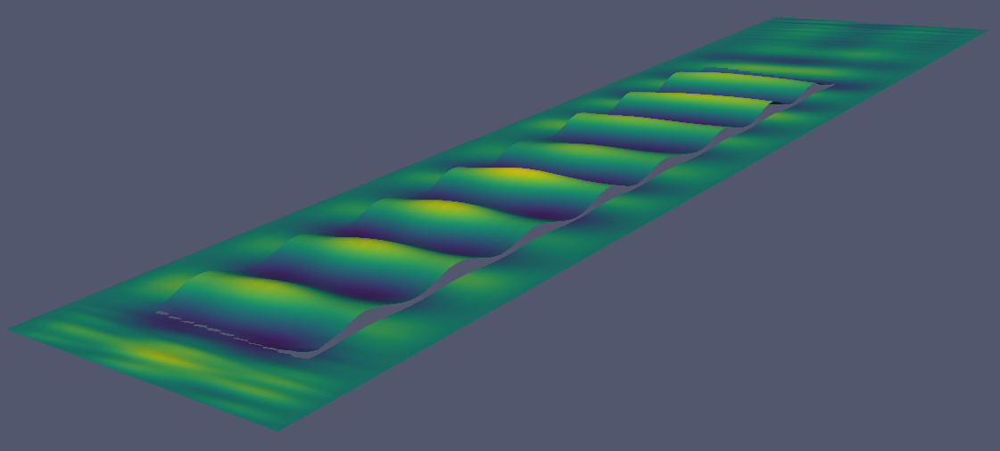
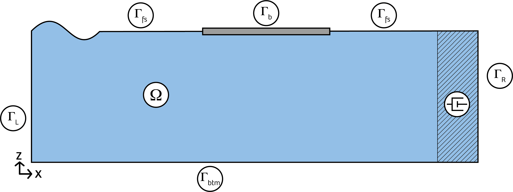
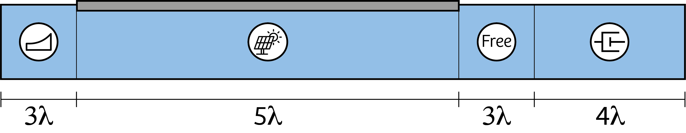

# Very Flexible Floating Structure (VFFS)
This tutorial shows how a Fluid Structure Interaction (FSI) in a 2D domain is modelled. Potential flow is used to model the fluid and on top a Dynamic Euler-Bernoulli beam is located that serves as the floating structure.



~~~<center><i>3D model</i></center>~~~

## Mathematics
First of all, let's dive in to the mathematics behind the problem. Potential flow is based on the principle that the velocity field can be described by the spatial derivatives of a scalar function, this is called the potential function. Moreover, the fluid is considered to be incom­pressible. This consideration implies that the divergence of the velocity is equal to zero. The potential function then satisfies the Laplace equation:

```math
\left\{\begin{array}{l}
\nabla \cdot \vec{u}=0 \\
\nabla \phi=\vec{u}
\end{array} \Leftrightarrow \nabla \cdot(\nabla \phi)=\Delta \phi=0 \quad\right. \text { in } \quad \Omega
```

Where $\Omega$ denotes the 2D domain.

Now it is time to set the boundary conditions of the domain. In this case, three different boundaries need to be applied:
- The bottom boundary
- The free surface boundary
- The structure boundary

### Bottom boundary
The bottom boundary (also called the sea bed boundary) states that the boundary is impermeable and given as:
$$
\nabla \phi \cdot \vec{n}=0 \quad \text { on } \quad \Gamma_{L} \cup \Gamma_{b t m} \cup \Gamma_{R} \quad \text { bottom b.c. }
$$

In this model, not only the bottom of the domain ($\Gamma_{btm}$) is impermeable, but also the left ($\Gamma_L$) and right ($\Gamma_R$) hand side of the domain (see figure below).



The top boundary, however, is not impermeable, but is the free surface boundary ($\Gamma_{fs}$). The fluid is able to move freely up and down, but mustn't leave the domain. Two conditions need to be applied here:
- The dynamic boundary condition
- The kinematic boundary condition

### Dynamic boundary condition
The dynamic free surface boundary condition states that the pressure above the free surface is constant and equal to zero. Using Bernoulli’s equation in the lin­earised form and assuming that there is no y­-direction (since the model is only 2D), the boundary condition is given as:
$$
\frac{\delta \phi}{\delta t}+g \eta=0 \quad \text { on } \quad \Gamma_{f s} \quad \text { dynamic free surface b.c. }
$$
Where $g$ is the gravity constant and $\eta$ is the surface elevation. With this boundary condition the formula of the potential flow can be derived and is equal to:
$$
\phi=\frac{\xi_{i} g}{\omega} \cdot \frac{\cosh \left(k_{i}(d+z)\right)}{\cosh \left(k_{i} d\right)} \cdot \sin \left(k_{i} x-\omega t\right)
$$
Where $\xi_i$ , $\omega$ and $k_i$ are the amplitude, the angular frequency and the wave number of the incident wave, respectively and $d$ the water depth.

### Kinematic boundary condition
Finally, the third boundary condition is the kinematic free surface boundary condition which describes that the vertical velocity of the free surface has to be equal to the vertical motion of the flow and is given as follows:
$$
\frac{\delta \phi}{\delta z}=\frac{\delta \eta}{\delta t} \quad \text { on } \quad \Gamma_{f s} \quad \text { kinematic free surface b.c. }
$$

### Cauchy-Poisson condition
Using this boundary condition the wave number can be related to the wave frequency. By differenti­ating the dynamic free surface boundary condition and inserting the kinematic free surface boundary condition one obtains the Cauchy-­Poisson condition:
$$
\frac{\delta \phi}{\delta z}+\frac{1}{g} \frac{\delta^{2} \phi}{\delta t^{2}}=0
$$
Substituting the potential function into the Cauchy-Poisson equation gives the dispersion relation:
$$
\omega^{2}=g k_{i} \tanh \left(k_{i} d\right)
$$

Using these equation, one is able to establish the free surface and the fluid domain can be modelled. However, we are interested in a fluid structure interaction, which means that there should also be a boundary condition at the location of the floating structure ($\Gamma_b$). This is done by imposing the Dynamic Euler-Bernoulli beam on a slice of the free surface.

### Dynamic Euler-Bernoulli beam
The dynamic Euler-Bernoulli beam is a one-dimensional equation that is valid if the loads are purely lateral and the deflections remain small. The general form of the Euler-Bernoulli beam describes a relation of the deflection of the beam ($w$) and an external force ($f(t)$) as function of time:
$$
E I \frac{\delta^{4} w}{\delta x^{4}}=-\mu \frac{\delta^{2} w}{\delta t^{2}}+f(x)
$$
Where $EI$ is the bending stiffness and $\mu$ is the mass per unit length.

Regarding the boundary conditions, the kinematic b.c. remains the same as for the free surface. However, the dynamic boundary condition changes to a non-zero solution and is multiplied by the fluid density $\rho_w$:
$$
-\rho_{w} \frac{\delta \phi}{\delta t}-\rho_{w} g \eta=p
$$
The pressure $p$ is equal to the external force of the Euler-Bernoulli beam:
$$
p=\rho_{b} h \frac{\delta^{2} \eta}{\delta t^{2}}+\frac{E I}{B} \frac{\delta^{4} \eta}{\delta x^{4}}
$$
Where $\mu$ is equal to the product of the structure density $\rho_b$ and the thickness of the structure $h$. The bending stiffness has been divided by the width ($B$) of the structure, as the model is only two-dimensional and the deflection $w$ has been replaced by the surface elevation $\eta$. Rewriting this into one equation results in the altered dynamic boundary condition:
$$
\rho_{b} h \frac{\delta^{2} \eta}{\delta t^{2}}+\frac{E I}{B} \frac{\delta^{4} \eta}{\delta x^{4}}+\rho_{w} \frac{\delta \phi}{\delta t}+\rho_{w} g \eta=0 \quad \text { on } \quad \Gamma_b
$$
Rewriting this equation and inserting the same governing kinematic free surface boundary condition results in an altered Cauchy­-Poisson condition with an added factor; three terms in between brackets:
$$
\left(\frac{\rho_{b} h}{\rho_{w} g} \frac{\delta^{2} \eta}{\delta t^{2}}+\frac{E I}{\rho_{w} g B} \frac{\delta^{4} \eta}{\delta x^{4}}+1\right) g \frac{\delta \phi}{\delta z}=-\frac{\delta^{2} \phi}{\delta t^{2}}
$$
Assuming that the solution of the free surface elevation is wave:
$$
\eta = \xi_b \cos{(k_b x - \omega t)}
$$
With $\xi_b$ and $k_b$ the amplitude and the wave number of the hydroelastic wave, respectively. Its second derivative in time and fourth derivative in space are given as:
$$
\begin{array}{l}
\eta_{t t}=-\omega^{2} \xi_{b} \cos \left(k_{b} x-\omega t\right) \\
\eta_{x x x x}=k_{b}^{4} \xi_{b} \cos \left(k_{b} x-\omega t\right)
\end{array}
$$
Inserting these wave terms and assuming initial conditions ($x = 0, t = 0$) the equation is given as:
$$
\left(-\frac{\omega^{2} \rho_{b} h}{\rho_{w} g}+\frac{k_{b}^{4} E I}{\rho_{w} g B}+1\right) g \frac{\delta \phi}{\delta z}=-\frac{\delta^{2} \phi}{\delta t^{2}}
$$
### Damping zone
At the end of the domain the wave energy should be dissipated to prevent wave reflection. This is done by adding a viscosity term to the set of equations. There are several ways to achieve this, but the most effective way is to use a method by [Kim Woo Min](http://dx.doi.org/10.1016/j.oceaneng.2013.10.012) who changed the kinematic boundary condition by adding two terms which dissipate the wave energy:
$$
\frac{\delta \eta}{\delta t}-\frac{\delta \phi}{\delta z}+\mu_{1} \eta+\frac{\mu_{2}}{g} \phi=0 \quad \text { kinematic b.c. damping zone}
$$
Where $\mu_1$ and $\mu_2$ are damping coefficients that follow from the iteratively chosen $\mu_0$, and are dependent on each other to ensure that no dispersion occurs:
$$
\begin{array}{l}
\mu_{1}(x)=\mu_{0}\left[1-\cos \left(\frac{\pi}{2}\left(\frac{x-x_{d}}{L_{d}}\right)\right)\right] \\
\mu_{2}=-\frac{\mu_{1}^{2}}{4}
\end{array}
$$
Where $x_d$ is starting point of the numerical damping zone and $L_d$ is the length of the damping zone.

## Numerical model
As the mathematics behind the model have been shown, it is now time to rewrite the system of equations into the weak formulation and insert them into the numerical model. However, in order to do so, we should first set up the numrical model.
### Wave parameters
Let's start with initiating a simple regular wave with a period of $T = 0.5$ s and a steepness of 1/25 with a water depth of $d = 1$ m. Using the just derived [Airy wave theory](https://en.wikipedia.org/wiki/Airy_wave_theory), the wave parameters can be calculated. The module `Roots` is used to calculate the root of the function.

```julia
using Roots
T = 0.5
steepness = 1/25
d = 1

ω = 2*π / T                 # angular frequency
g = 9.81                    # gravity constant
f(k) = √(g*k*tanh(k*d)) - ω
k = abs(find_zero(f, 0.5))  # wave number
λ = 2*π / k                 # wavelength
ξ = λ * steepness / 2       # wave amplitude
```

### Material parameters
Next to the wave parameters, the structure also contains several properties, such as a stiffness, a thickness and a density. The fluid density has been set equal to the sea and the VFFS is made of a 0.005 m rubber-like material called [Neoprene](https://en.wikipedia.org/wiki/Neoprene), which is very flexible. The width of the structure has not been taken into account and it is assumed that the cross-section is a rectangle.

```julia
ρ_w = 1025    # fluid density
ρ_b = 116     # structure density
E = 560e3     # Young's modulus
h = 0.005     # thickness
I = h^3 / 12  # moment of inertia
EI = E * I    # bending stiffness
```

For 3D applications the bending stiffness $EI$ should be replaced by the flexural rigidity $D$ and can be calculated as follows:
$$
D = \frac{E h^3}{12 (1-\nu^2)}
$$
Where $\nu$ is the Poisson's ratio.

```julia
ν = 0.4
D = E * h^3 / (12 * (1-ν^2) )
```

However, this tutorial will focus on a 2D domain, so this will be discarded.
### Domain
The domain of the model is defined such that the free surface waves can develop and travel a few wavelengths before they reach the structure. The structure must be longer than the incident wavelength in order to be assumed a VFFS. Finally, the waves will leave the structure and are free surface waves again. Before the waves reach the end of the domain the wave energy should be dissipated to prevent wave reflection at the right hand side of the domain ($\Gamma_R$) The picture below shows the set-up of the model.



To define the domain the `Gridap` module is used and the different zones are specified:

```julia
using Gridap
using Gridap.Geometry
using GridapODEs
using GridapODEs.TransientFETools
using GridapODEs.ODETools

Li = 3*λ # length of incident wave zone
Lb = 5*λ # length of VFFS
Lo = 3*λ # length of outgoing wave zone
Ld = 4*λ # length of damping zone

xb₀ = Li        # x-coordinate start VFFS
xb₁ = Li + Lb   # x-coordinate end VFFS
x₂ = xb₁ + Lo   # x-coordinate start damping zone
x₃ = x₂ + Ld    # end of domain

Xmin = 0
Xmax = x₃
Zmin = 0
Zmax = d

domain = (Xmin, Xmax, Zmin, Zmax)
```

### Damping zone
With these values the formula for the damping zone can be established. It is chosen to use a value of $\mu_0 = 10$:

```julia
μ₀ = 10
μ₁(x::VectorValue) = μ₀*(1.0 - cos(π/2*(x[1]-x₂)/Ld)) * (x[1]>x₂)
μ₂(x::VectorValue) = -(μ₁(x::VectorValue)^2)/4 * (x[1]>x₂)
```

### Resolution
To define the resolution of the domain a partition is given. This is the amount of grid cells that the model contains. The resolution in the x-direction should be high, as we are interested in the exact shape of the wave. For the z-direction, however, we are only interested in the top layer near the free surface. It is assumed that the vertical velocity profile goes to zero when it reaches the bottom, so not much is going on as we proceed towards the bottom of the domain. Therefore, the resolution in x-direction is set to 50 cells per wavelength and for the z-direction only 10 cells are which have been unevenly spaced so that the resolution is fine at the free surface, but becomes coarser as we go down. This is done using the argument `map` in the function `CartesianDiscreteModel`. The function `simplexify` is used to change the mesh to an affine reference map, which is necessary to have the mapping work.

$$
\begin{array}{cl}
z_{i}=d-\frac{d}{2^{i}} & \text { for } \quad i<n_{\text {cells}, z} \\
z_{i}=d & \text { for } \quad i=n_{\text {cells}, z}
\end{array}
$$

```julia
meshX = 50
meshZ = 10
function f_z(x)
    if x == d
        return d
    end
    i = x / (d/meshZ)
    return d-d/(2^i)
end
map(x) = VectorValue(x[1],f_z(x[2]))
Xspan = Int(round((Xmax - Xmin) / λ))
Zspan = Int(round((Zmax - Zmin) / λ))
partition = (Xspan * meshX, Zspan * meshZ)
model_Ω = simplexify(CartesianDiscreteModel(domain,partition, map=map))
Ω = Triangulation(model_Ω)
```

### Boundaries

As the numerical domain `model_Ω` has been initiated, we wil now define the location of the floating structure using the following function and using a `mask`:

```julia
function is_beam(coords)
    n = length(coords)
    x = (1/n)*sum(coords)
    (xb₀ <= x[1] <= xb₁ ) * ( x[2] ≈ d )
end

labels = get_face_labeling(model_Ω)

bgface_to_mask = get_face_mask(labels,[3,4,6],1)
Γface_to_bgface = findall(bgface_to_mask)
model_Γ = BoundaryDiscreteModel(Polytope{1},model_Ω,Γface_to_bgface)
Γ = Triangulation(model_Γ)

Γface_coords = get_cell_coordinates(Γ)
Γface_mask = lazy_map(is_beam,Γface_coords)
Γbface_Γface = findall(Γface_mask)
Γfface_Γface = findall(!,Γface_mask)

Γb = BoundaryTriangulation(model_Ω,view(Γface_to_bgface,Γbface_Γface))
Γf = BoundaryTriangulation(model_Ω,view(Γface_to_bgface,Γfface_Γface))
```

As well as the other boundaries:

```julia
add_tag_from_tags!(labels,"bottom",[1,2,5])
add_tag_from_tags!(labels,"inlet",[7])
add_tag_from_tags!(labels,"outlet",[8])
add_tag_from_tags!(labels, "water", [9])
```

The inlet of the domain is specified and a vertical velocity profile is imposed which is based on the gradient of the potential function:

$$
\frac{\delta \phi}{\delta x} =\omega \xi \frac{\cosh k(z+d)}{\sinh k d} \cos (k x-\omega t - \theta)
$$

```julia
Γin = BoundaryTriangulation(model_Ω, tags = ["inlet"])

θ = π/2 # phase shift
function v_inlet(x,t)
    return (ω * ξ * ( cosh( k * (x[2]) ) / sinh( k * d ) ) * cos(k * x[1] - ω * t - θ))
end

v_inlet(t::Real) = x -> v_inlet(x,t)
```

Finally, the quadratures are specified for each boundary:

```julia
order = 2
dΩ = Measure(Ω,2*order)
dΓb = Measure(Γb,2*order)
dΓf = Measure(Γf,2*order)
dΓin = Measure(Γin,2*order)

Λb = SkeletonTriangulation(model_Γ,Γface_mask)
nΛb = get_normal_vector(Λb)
dΛb = Measure(Λb,2*order)
mean_mask = CellField(mean(CellField(Γface_mask,Γ)),Λb)
```

### Finite Element spaces
As the numerical domain has been set and the boundaries have been defined, the test spaces can be constructed. For this type of problem, two spaces will be built; one for the internal domain `model_Ω` and one for the free surface `model_Γ`. Both will use lagrangian shape functions and are of order two. For the free surface there will be imposed dirichlet boundary conditions on all boundaries except for the free surface.

```julia
reffe = ReferenceFE(lagrangian,Float64,order)
V_Ω = TestFESpace(
    model_Ω,
    reffe,
    conformity=:H1
    )
V_Γ = TestFESpace(
    model_Γ,
    reffe,
    conformity=:H1,
    dirichlet_tags=["bottom", "water", "inlet", "outlet"]
    )
```

A `TrialFESpace` is established using the test spaces and dirichlet boundary conditions. Note that for the `"bottom"`, `"water"` and `"outlet"` boundary the value is set to zero using the function `u`. For the `"inlet"` boundary, the dirichlet condition is set to a vertical velocity profile which has been specified with the function `v_inlet`.

```julia
u(x,t) = 0
u(t::Real) = x -> u(x,t)
U_Ω = TransientTrialFESpace(V_Ω)
U_Γ = TransientTrialFESpace(V_Γ, [u,u,v_inlet,u])
```

The test spaces and trial spaces are combined in a `MultiFieldFESpace` indicated by `X` and `Y`, respectively.

```julia
X = TransientMultiFieldFESpace([U_Ω,U_Γ])
Y = MultiFieldFESpace([V_Ω,V_Γ])
```

### Numerical time integration
To solve the system in time, a numerical time integration scheme needs to be chosen. As the set of equations consists of a second temporal derivative, the [Newmark-beta](https://en.wikipedia.org/wiki/Newmark-beta_method) integration scheme has been chosen, which is widely used in the dynamic response of structures. Generally, the system is explicit, however, by choosing the parameters $\beta = 0.25$ and $\gamma = 0.5$, the system becomes unconditionally stable, which means that the time step can be chosen independently of the grid resolution. In this case, it was found that the results were accurate if the time step was equal to grid resolution in x-direction, resulting in a time step of 1/50 of the wave period.

$$
\mathbf{M} \ddot{y}+\mathbf{C} \dot{y}+f^{i n t}(y)=f^{e x t}
$$

$$
\begin{array}{l}
\dot{y}_{n+1}=\dot{y}_{n}+(1-\gamma) \Delta t \ddot{y}_{n}+\gamma \Delta t \ddot{y}_{n+1} \\
y_{n+1}=y_{n}+\Delta t \dot{y}_{n}+\frac{\Delta t^{2}}{2}\left((1-2 \beta) \ddot{y}_{n}+2 \beta \ddot{y}_{n+1}\right) \\
\mathbf{M} \ddot{y}_{n+1}+\mathbf{C} \dot{y}_{n+1}+f^{\text {int }}\left(y_{n+1}\right)=f_{n+1}^{\text {ext }}
\end{array}
$$

```julia
γ = 0.5   # Newmark beta factor
β = 0.25  # Newmark beta factor
Δt = T / meshX # time step
```

### Stabilisation terms
To make sure that the system of equations is coercive, the weak formulation is stabilised by stabilisation terms. Currently, [Oriol Colomés Gené](https://www.tudelft.nl/citg/over-faculteit/afdelingen/hydraulic-engineering/sections/offshore-engineering/staff/dr-oj-oriol-colomes-gene) is doing research to find the correct set of stabilisation terms to solve this problem. For now, a default value of $αh = 0.5$ is used to display the correct values.

```julia
∂ut_∂u = γ/(β*Δt)
∂utt_∂u = 1/(β*Δt^2)
αh = 0.5                                                      # default value
h_m = min((Xmax-Xmin)/partition[1],(Zmax-Zmin)/partition[2])
β_f = ∂ut_∂u / (αh*g + ∂ut_∂u)                                # stability parameter fluid
β_b = ∂ut_∂u / (αh*(ρ_b/ρ_w*h*∂utt_∂u + g) + ∂ut_∂u)          # stability parameter structure
γ_m = 1.0e2*order*(order+1)
```

`s((ϕ,η),(w,v))` is a function containing all stabilisation terms that will be included in the weak formulation to ensure a stable system.

```julia
s((ϕ,η),(w,v)) = ∫( (mean_mask==1)*β_b*EI/ρ_w*( - ( jump(∇(v)⋅nΛb) * mean(Δ(η)) + jump(αh*∇(w)⋅nΛb) * mean(Δ(η)) ) - ( mean(Δ(v)) * jump(∇(η)⋅nΛb) ) + γ_m/h_m * ( jump(∇(v)⋅nΛb) * jump(∇(η)⋅nΛb) + αh*jump(∇(w)⋅nΛb) * jump(∇(ϕ)⋅nΛb) ) ) )dΛb
```

### Weak formulation

The weak form is the set of equations that will be solved by `Gridap`. The Newmark-beta scheme distinguishes between three different matrices; the mass matrix $M$ which contains the seond derivative terms, the damping matrix $C$ which contains the first derivative terms, $f_{int}$ and the other terms of the standard form. Finally there is the vector that includes the external loads $f_{ext}$. In `Gridap`, four functions are used that resemble the mentioned matrices. `m((ϕtt,ηtt),(w,v))`, `c((ϕt,ηt),(w,v))` and `a((ϕ,η),(w,v))` form the bi-linear form and `b(t,(w,v))` is the vector containing the externeal forces.

```julia
m((ϕtt,ηtt),(w,v)) = ∫( ρ_b/ρ_w*h*ηtt*β_b*(v+αh*w) )dΓb

c((ϕt,ηt),(w,v)) =  ∫( β_f*(αh*w + v)*ϕt - w*ηt )dΓf +
                    ∫( β_b*(αh*w + v)*ϕt - w*ηt )dΓb

a((ϕ,η),(w,v)) =  ∫( ∇(ϕ)⋅∇(w) )dΩ +
                  ∫( β_f*(v + αh*w) * g*η - μ₁*η*w - μ₂*ϕ*w/g )dΓf +
                  ∫( β_b*(Δ(v) + αh*Δ(w)) * EI/ρ_w*Δ(η) + β_b*(v + αh*w) * g*η + EI/ρ_w*αh*Δ(w)*Δ(ϕ) )dΓb +
                  s((ϕ,η),(w,v))

b(t,(w,v)) =  ∫( v_inlet(t) * w )dΓin +
              ∫( β_b*(αh*w + v)*(-0.0) )dΓb
```

The set of equations is combined into one matrix and the numerical solver is set up.

### Solver

```julia
op = TransientConstantMatrixFEOperator(m,c,a,b,X,Y)
ls = LUSolver()
odes = Newmark(ls,Δt,γ,β)
solver = TransientFESolver(odes)
```

The initial solution is set to zero.

```julia
x₀ = interpolate_everywhere([0.0, 0.0],X(0.0))
v₀ = interpolate_everywhere([0.0, 0.0],X(0.0))
a₀ = interpolate_everywhere([0.0, 0.0],X(0.0))
```

And all time steps are set, ready to be computed.

```julia
t₀ = 0.0
periods = 50
tf = periods * T
sol_t = Gridap.solve(solver,op,(x₀,v₀,a₀),t₀,tf)
```

The `WriteVTK` and `FileIO` modules are loaded to store the results on the computer and a directory is created to store all the files.

```julia
using WriteVTK
using FileIO


folderName = "solution"
if !isdir(folderName)
    mkdir(folderName)
end
```

The model consists of three parts; the 2D potential domain and the free surface which can be subdivided into the fluid part and structure part. Each is stored seperately and can be viewed in [Paraview](https://www.paraview.org/download/).

```julia
filePath_Ω = folderName * "/fields_O"
filePath_Γb = folderName * "/fields_Gb"
filePath_Γf = folderName * "/fields_Gf"
pvd_Ω = paraview_collection(filePath_Ω, append=false)
pvd_Γb = paraview_collection(filePath_Γb, append=false)
pvd_Γf = paraview_collection(filePath_Γf, append=false)
```

Finally, a for loop is created that runs through all the timesteps and stores the potential `ϕn` and the surface elevation `ηn` of each time step.

```julia
for ((ϕn,ηn),tn) in sol_t
  println(tn)

  pvd_Ω[tn] = createvtk(Ω,filePath_Ω * "_$tn.vtu",cellfields = ["phi" => ϕn],order=2)
  pvd_Γb[tn] = createvtk(Γb,filePath_Γb * "_$tn.vtu",cellfields = ["eta" => ηn],nsubcells=10)
  pvd_Γf[tn] = createvtk(Γf,filePath_Γf * "_$tn.vtu",cellfields = ["eta" => ηn],nsubcells=10)

end

vtk_save(pvd_Ω)
vtk_save(pvd_Γb)
vtk_save(pvd_Γf)
```

This is the end of the tutorial and I hope you now understand how to build a fluid structure interaction in `Gridap`. If you want to learn extra things, like storing values of a test run or calculating the energy in the system, please take a look below in the Extra's section.

## Extra's
The following blocks of code help to further explore the results that have been generated with the numerical model. If you want to run this file please comment out the full Extra's section to have the code properly work.

### Storing values
Sometimes, you don't want to only look at the results in Paraview, but also use them for more scientific uses. Then it is convenient to store all the values in a `Dict()`.  By creating a dictionary, it is possible to save all variables in a wrapper. Here, the module `JLD2` is used which also gives the possibilty to save a `.jld2` file which contains all the data. Just follow the approach below:

```julia
using DelimitedFiles
using JLD2

dat = Dict()

dat[:λ] = λ
dat[:ξ] = ξ
dat[:st] = steepness
dat[:d] = d
dat[:k] = k
dat[:ω] = ω
dat[:T] = T

dataname = "data"
datapath = "solution"
save(datapath * "$dataname.jld2", "data", dat)
```

### Saving free surface as vector
To save surface elevation as a datastring, a few extra lines need to be added to the for loop. A `global` variable `ηns` is created before the for loop. In the loop, for each time step, the surface elevation is stored in a local variable `surface` and subsequently `push!`'ed to `ηns`. The datastring can be stored in a JLD2 file as mentioned in the previous section.

```julia
global ηns = []
for ((ϕn,ηn),tn) in sol_t
  println(tn)

  global cell_values_ηn = get_cell_dof_values(ηn)
  surface = []
  for i in 1:length(cell_values_ηn)
      push!(surface, cell_values_ηn[i][3])
  end
  push!(ηns, surface')
  ηns = vcat(ηns...)

end
```

### Calculating energy in the system
To check the amount of energy in the system, the sum of all values can be taken in the for loop as well. Here, we distinguish the energy between potential energy `Eₚ_f` and kinetic energy `Eₖ_f` for the free surface. For the structure, two more energy terms are taken into account; the kinetic energy `Eₖ_b` and the elastic energy `Eₚ_b` of the structure. In this example the energy is calculated at three different locations; the incident wave zone `xp1`, the hydroelastic wave zone `xp2` and the outgoing wave zone `xp3`.

```julia
global Eₖ_f_p1 = []
global Eₚ_f_p1 = []

global Eₖ_f_p2 = []
global Eₖ_b_p2 = []
global Eₚ_f_p2 = []
global Eₚ_b_p2 = []

global Eₖ_f_p3 = []
global Eₚ_f_p3 = []

global η_0 = interpolate_everywhere(0.0, U_Γ(0.0))

global xp1 = 1 * λ
global xp2 = 3 * λ
global xp3 = 9 * λ

x_p1(x) = (xp1 <= x[1] <= (xp1 + λ))
x_p2(x) = (xp2 <= x[1] <= (xp2 + (λ)))
x_p3(x) = (xp3 <= x[1] <= (xp3 + λ))

for ((ϕn,ηn),tn) in sol_t
  println(tn)

  push!(Eₖ_f_p1, 0.5 * ρ_w * ∑( ∫(∇(ϕn)⋅∇(ϕn) * x_p1 )dΩ))
  push!(Eₚ_f_p1, 0.5 * ρ_w * g * ∑( ∫((ηn*ηn) * x_p1)dΓf ))

  push!(Eₖ_f_p2, 0.5 * ρ_w * ∑( ∫(∇(ϕn)⋅∇(ϕn) * x_p2 )dΩ))
  push!(Eₚ_b_p2, 0.5 * EI * (∑( ∫(Δ(ηn)⋅Δ(ηn) * x_p2 )dΓb )))
  push!(Eₖ_b_p2, 0.5 * ρ_b * h * ∑( ∫((ηₜ*ηₜ) * x_p2 )dΓb ))
  push!(Eₚ_f_p2, 0.5 * ρ_w * g * ∑( ∫((ηn*ηn) * x_p2 )dΓb ))

  push!(Eₖ_f_p3, 0.5 * ρ_w * ∑( ∫(∇(ϕn)⋅∇(ϕn) * x_p3 )dΩ ))
  push!(Eₚ_f_p3, 0.5 * ρ_w * g * ∑( ∫((ηn*ηn) * x_p3 )dΓf ))

  η_0 = interpolate_everywhere(ηn, U_Γ(tn))

end
```
